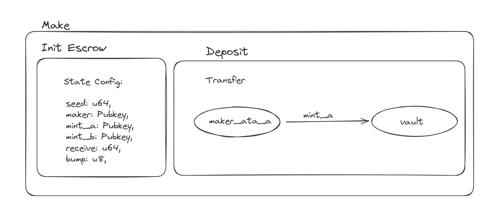
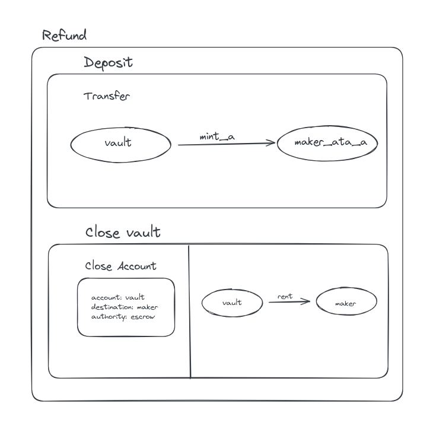
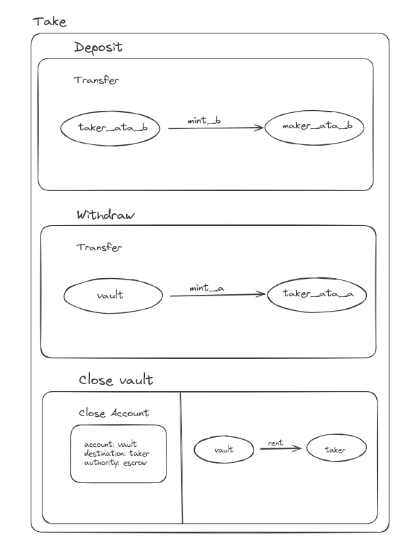

# Anchor Escrow

A solana program which holds on to the funds until a condition is met. Here, the user (maker) who initiates, deposits their tokens of mint_a to the vault owned by the program in exchange for an amount of tokens of mint_b. Now any user (taker) can take up their offer and deposit the amount expected by the maker and recieve the tokens of mint_a from the vault to their account atomically. So this is how we achieve a trustless conditional transfer.

---

## Let's walk through the architecture:

For this program, we will have one state account, the escrow account:

```rust
#[account]
#[derive(InitSpace)]
pub struct Escrow {
    pub seed: u64,
    pub maker: Pubkey,
    pub mint_a: Pubkey,
    pub mint_b: Pubkey,
    pub receive: u64,
    pub bump: u8,
}
```

The escrow account will hold the following data:

- `seed`: A random number used to generate the escrow account's address. This allows each user to create multiple escrow accounts.
- `maker`: The account that created the escrow account.
- `mint_a`: The mint of the token the maker is trading with.
- `mint_b`: The mint of the token the maker is trading for.
- `receive`: The amount of tokens that need to be received before the funds are released.
- `bump`: Since our Escrow account will be a PDA, we will store the bump of the account.

---

## The user will be able to create an escrow account. For that, we create the following context:



```rust
#[derive(Accounts)]
#[instruction(seed: u64)]
pub struct Make<'info> {
  #[account(mut)]
  pub maker: Signer<'info>,
  #[account(
      mint::token_program = token_program
  )]
  pub mint_a: InterfaceAccount<'info, Mint>,
  #[account(
      mint::token_program = token_program
  )]
  pub mint_b: InterfaceAccount<'info, Mint>,
  #[account(
      mut,
      associated_token::mint = mint_a,
      associated_token::authority = maker,
      associated_token::token_program = token_program
  )]
  pub maker_ata_a: InterfaceAccount<'info, TokenAccount>,
  #[account(
      init,
      payer = maker,
      space = 8 + Escrow::INIT_SPACE,
      seeds = [b"escrow", maker.key().as_ref(), seed.to_le_bytes().as_ref()],
      bump
  )]
  pub escrow: Account<'info, Escrow>,
  #[account(
      init,
      payer = maker,
      associated_token::mint = mint_a,
      associated_token::authority = escrow,
      associated_token::token_program = token_program
  )]
  pub vault: InterfaceAccount<'info, TokenAccount>,
  pub associated_token_program: Program<'info, AssociatedToken>,
  pub token_program: Interface<'info, TokenInterface>,
  pub system_program: Program<'info, System>,
}
```

Let´s have a closer look at the accounts that we are passing in this context:

- `maker`: The account that is creating the escrow account.
- `mint_a`: The mint of the token the maker is trading with.
- `mint_b`: The mint of the token the maker is trading for.
- `maker_ata_a`: The associated token account of the maker for the mint_a.
- `escrow`: Will be the state account that we will initialize and the maker will be paying for the initialization of the account. We derive the Escrow PDA from the byte representation of the word "escrow", reference of the maker publickey and reference of the little-endian bytes format of seeds we got from instruction attribute. Anchor will calculate the canonical bump (the first bump that throws that address out of the ed25519 eliptic curve) and save it for us in a struct.
- `vault`: The vault account that will hold the tokens of mint_a until the condition is met is initialised and maker will be paying for also this. The escrow account will be the authority to this token account.
- `associated_token_program`: The associated token program.
- `token_program`: The token program.
- `system_program`: The system program.

## We then implement some functionality for our Make context:

```rust
impl<'info> Make<'info> {
    pub fn save_escrow(&mut self, seed: u64, receive: u64, bumps: &MakeBumps) -> Result<()> {
        self.escrow.set_inner(Escrow {
            seed,
            maker: self.maker.key(),
            mint_a: self.mint_a.key(),
            mint_b: self.mint_b.key(),
            receive,
            bump: bumps.escrow,
        });
        Ok(())
    }

    pub fn deposit(&mut self, deposit: u64) -> Result<()> {
        let transfer_accounts = TransferChecked {
            from: self.maker_ata_a.to_account_info(),
            mint: self.mint_a.to_account_info(),
            to: self.vault.to_account_info(),
            authority: self.maker.to_account_info(),
        };

        let cpi_ctx = CpiContext::new(self.token_program.to_account_info(), transfer_accounts);

        transfer_checked(cpi_ctx, deposit, self.mint_a.decimals)
    }
}
```

In the `save_escrow` function, we set the escrow account's data. In the `deposit` function, we transfer tokens from the maker's associated token account to the vault account.

---

## The maker of an escrow can refund the tokens from the vault and close the escrow account. For that, we create the following context:



```rust
#[derive(Accounts)]
pub struct Refund<'info> {
    #[account(mut)]
    maker: Signer<'info>,
    mint_a: InterfaceAccount<'info, Mint>,
    #[account(
        mut,
        associated_token::mint = mint_a,
        associated_token::authority = maker,
        associated_token::token_program = token_program
    )]
    maker_ata_a: InterfaceAccount<'info, TokenAccount>,
    #[account(
        mut,
        close = maker,
        has_one = mint_a,
        has_one = maker,
        seeds = [b"escrow", maker.key().as_ref(), escrow.seed.to_le_bytes().as_ref()],
        bump = escrow.bump
    )]
    escrow: Account<'info, Escrow>,
    #[account(
        mut,
        associated_token::mint = mint_a,
        associated_token::authority = escrow,
        associated_token::token_program = token_program
    )]
    pub vault: InterfaceAccount<'info, TokenAccount>,
    associated_token_program: Program<'info, AssociatedToken>,
    token_program: Interface<'info, TokenInterface>,
    system_program: Program<'info, System>,
}
```

In this context, we are passing all the accounts that we need to refund the funds and close the escrow account:

- `maker`: The account that is refunding the funds and closing the escrow account.
- `mint_a`: The mint of the token the maker is trading with.
- `maker_ata_a`: The associated token account of the maker for the mint_a.
- `escrow`: The escrow account that holds the escrow state.
- `vault`: The vault account that holds the tokens of mint_a until the condition is met.
- `associated_token_program`: The associated token program.
- `token_program`: The token program.
- `system_program`: The system program.

## We then implement some functionality for our Refund context:

```rust
impl<'info> Refund<'info> {
    pub fn refund_and_close_vault(&mut self) -> Result<()> {
        let signer_seeds: [&[&[u8]]; 1] = [&[
            b"escrow",
            self.maker.to_account_info().key.as_ref(),
            &self.escrow.seed.to_le_bytes()[..],
            &[self.escrow.bump],
        ]];

        let xfer_accounts = TransferChecked {
            from: self.vault.to_account_info(),
            mint: self.mint_a.to_account_info(),
            to: self.maker_ata_a.to_account_info(),
            authority: self.escrow.to_account_info(),
        };

        let ctx = CpiContext::new_with_signer(
            self.token_program.to_account_info(),
            xfer_accounts,
            &signer_seeds,
        );

        transfer_checked(ctx, self.vault.amount, self.mint_a.decimals)?;

        let close_accounts = CloseAccount {
            account: self.vault.to_account_info(),
            destination: self.maker.to_account_info(),
            authority: self.escrow.to_account_info(),
        };

        let ctx = CpiContext::new_with_signer(
            self.token_program.to_account_info(),
            close_accounts,
            &signer_seeds,
        );

        close_account(ctx)
    }
}
```

In the `refund_and_close_vault` function, we transfer the tokens from the vault account to the maker's associated token account and then close the vault account and rent is claimed by the maker.
Since the transfer occurs from a PDA, we need to pass the seeds while defining the context for the CPI.

---

## The Taker of an escrow can deposit tokens of mint_b to the maker and recieve tokens of mint_a that the maker deposited. For that, we create the following context:



```rust
#[derive(Accounts)]
pub struct Take<'info> {
    #[account(mut)]
    pub taker: Signer<'info>,
    #[account(mut)]
    pub maker: SystemAccount<'info>,
    pub mint_a: InterfaceAccount<'info, Mint>,
    pub mint_b: InterfaceAccount<'info, Mint>,
    #[account(
        init_if_needed,
        payer = taker,
        associated_token::mint = mint_a,
        associated_token::authority = taker,
        associated_token::token_program = token_program,
    )]
    pub taker_ata_a: Box<InterfaceAccount<'info, TokenAccount>>,
    #[account(
        mut,
        associated_token::mint = mint_b,
        associated_token::authority = taker,
        associated_token::token_program = token_program,
    )]
    pub taker_ata_b: Box<InterfaceAccount<'info, TokenAccount>>,
    #[account(
        init_if_needed,
        payer = taker,
        associated_token::mint = mint_b,
        associated_token::authority = maker,
        associated_token::token_program = token_program,
    )]
    pub maker_ata_b: Box<InterfaceAccount<'info, TokenAccount>>,
    #[account(
        mut,
        close = maker,
        has_one = maker,
        has_one = mint_a,
        has_one = mint_b,
        seeds = [b"escrow", maker.key().as_ref(), escrow.seed.to_le_bytes().as_ref()],
        bump = escrow.bump
    )]
    escrow: Account<'info, Escrow>,
    #[account(
        mut,
        associated_token::mint = mint_a,
        associated_token::authority = escrow,
        associated_token::token_program = token_program,
    )]
    pub vault: InterfaceAccount<'info, TokenAccount>,
    pub associated_token_program: Program<'info, AssociatedToken>,
    pub token_program: Interface<'info, TokenInterface>,
    pub system_program: Program<'info, System>,
}
```

In this context, we are passing all the accounts that we need to deposit funds and receive the funds that the maker deposited:

- `taker`: The account that is depositing mint_b tokens and receiving the mint_a tokens that the maker deposited.
- `maker`: The account that created the escrow account.
- `mint_a`: The mint of the token the maker is trading with.
- `mint_b`: The mint of the token the maker is trading for.
- `taker_ata_a`: The associated token account of the taker for mint_a.
- `taker_ata_b`: The associated token account of the taker for mint_b.
- `maker_ata_b`: The associated token account of the maker for mint_b.
- `escrow`: The escrow account that holds the escrow state.
- `vault`: The vault account that holds the tokens of mint_a until the condition is met.
- `associated_token_program`: The associated token program.
- `token_program`: The token program.
- `system_program`: The system program.

## We then implement some functionality for our Take context:

```rust
impl<'info> Take<'info> {
    pub fn deposit(&mut self) -> Result<()> {
        let transfer_accounts = TransferChecked {
            from: self.taker_ata_b.to_account_info(),
            mint: self.mint_b.to_account_info(),
            to: self.maker_ata_b.to_account_info(),
            authority: self.taker.to_account_info(),
        };

        let cpi_ctx = CpiContext::new(self.token_program.to_account_info(), transfer_accounts);

        transfer_checked(cpi_ctx, self.escrow.receive, self.mint_b.decimals)
    }

    pub fn withdraw_and_close_vault(&mut self) -> Result<()> {
        let signer_seeds: [&[&[u8]]; 1] = [&[
            b"escrow",
            self.maker.to_account_info().key.as_ref(),
            &self.escrow.seed.to_le_bytes()[..],
            &[self.escrow.bump],
        ]];

        let accounts = TransferChecked {
            from: self.vault.to_account_info(),
            mint: self.mint_a.to_account_info(),
            to: self.taker_ata_a.to_account_info(),
            authority: self.escrow.to_account_info(),
        };

        let ctx = CpiContext::new_with_signer(
            self.token_program.to_account_info(),
            accounts,
            &signer_seeds,
        );

        transfer_checked(ctx, self.vault.amount, self.mint_a.decimals)?;

        let accounts = CloseAccount {
            account: self.vault.to_account_info(),
            destination: self.taker.to_account_info(),
            authority: self.escrow.to_account_info(),
        };

        let ctx = CpiContext::new_with_signer(
            self.token_program.to_account_info(),
            accounts,
            &signer_seeds,
        );

        close_account(ctx)
    }
}
```

In the `deposit` function, we transfer tokens of mint_b from the taker's associated token account to the maker's associated token account. In the `withdraw_and_close_vault` function, we transfer the tokens of mint_a from the vault account to the taker's associated token account and then close the vault account. Since the transfer and the close occurs from a PDA, we need to pass the seeds while defining the context of the CPI for transfer_checked function and the close_account function.
